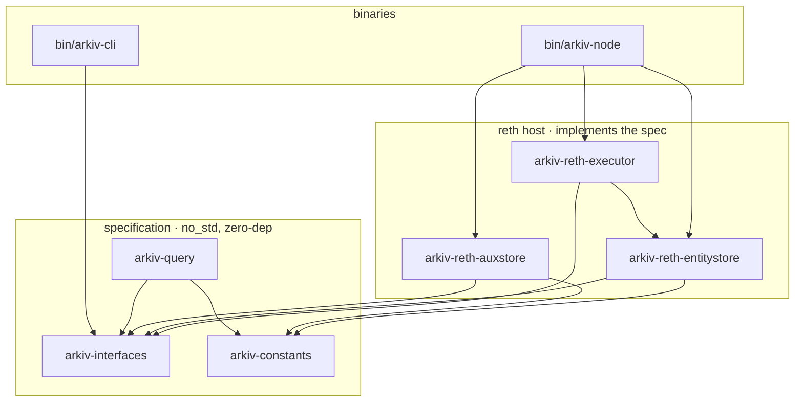
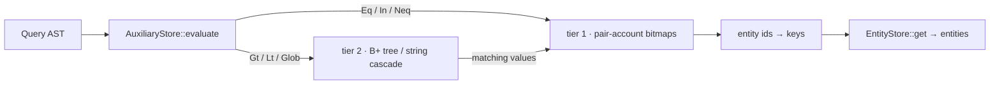

# Arkiv architecture

How the Arkiv database is built inside a reth execution layer. This is the map for
the crates under `crates/` — read it before diving into any one of them.

Arkiv stores **entities**: owned, expiring records carrying a payload and queryable
attributes. They live in Ethereum's world state, so every entity write is part of
consensus and commits into the state root. Clients read them back through an
`arkiv_*` JSON-RPC surface and a small query language.

## The one idea: spec vs host

Everything hangs off one boundary.

- **`arkiv-interfaces` is the specification.** It is `#![no_std]`, pulls in **no
  external crates**, and contains only the *traits a host implements* plus the
  *plain data they exchange*. Values are fixed-width byte arrays (`[u8; 20]`,
  `[u8; 32]`), never a library's types; errors are an associated `type Error: Debug`.
  It names no reth, revm, alloy, or storage backend.

- **A host implements the spec.** Today that host is reth (`arkiv-reth-*`). The host
  owns everything the spec deliberately doesn't: **consensus** (who sequences, who
  signs, how agreement is reached), the **physical layout** (which account an entity
  lives at, which storage slot an index bucket uses), and all host encodings (RLP,
  ABI, the account model).

The dividing line: **the spec owns committed state, its commitments, and — later —
inclusion/exclusion proofs over that state.** *How* the same state is agreed is not
the spec's concern. That's what makes the model portable: a different host (a
cosmos app, say) could implement the same `arkiv-interfaces` traits without touching
the Arkiv definitions.

The spec's pieces:

| Trait | What it is |
|---|---|
| `EntityStore` | The entities: a key → `Entity` map with a commitment |
| `AuxiliaryStore` | The query index over them: answers a `Query` with matching keys |
| `TransactionExecutor` / `BlockExecutor` | Run one transaction / a block, staging changes into a `BlockDraft` |
| `QueryProcessor` | Answer a query at the tip with a page of entities |
| `EntityCodec` | The versioned entity ⇄ bytes contract (a consensus format) |
| `CostModel`, `ArkivRpc` | Gas pricing seam; the `arkiv_*` RPC surface |

Both stores are part of consensus and **commit to their own contents separately**.
Writes are **batched, delta-based**: an executor stages a `BlockDraft`
(`BlockEntityStoreDelta` + `BlockAuxiliaryStoreDelta`), and the stores' `apply_delta`
commit it at block end — not mid-transaction write-through.

Crate-wise, everything points *down* at the spec — the host depends on
`arkiv-interfaces`, never the reverse:

## Entities and the entity store

An entity is stored **as the `code` of its own account**.

- **Address** (`arkiv-reth-entitystore::layout`): `entity_address(key) = key[..ADDRESS_LEN]`
  — the first 20 bytes of the 32-byte key. A pure identity anchor; content is
  committed via the account's `codeHash`, not its address.
- **Record codec** (`::record`): the account code is `0xFE || version || RLP(entity
  fields)`. `0xFE` is the EVM `INVALID` opcode, so a stray `CALL` to an entity
  account halts — entities are data, never executed. The version byte (prefix
  `0xFE00` today) lets the layout evolve without breaking shipped state, exactly like
  the spec's `EntityCodec`. The RLP field order is **consensus-critical**.
- **The seam** (`::store`, `::backend`, `::account`): `RethEntityStore<B>` maps keys
  to accounts and delegates raw persistence to an `EntityBackend`. `CodeBackend<C>`
  implements that backend by encoding/decoding the record into account `code`, over
  an `AccountCode` trait — the minimal "read/write an account's code" surface. This
  layering keeps the store logic reth-free and unit-testable behind a mock.

## The query index (two tiers)

`AuxiliaryStore` answers the query language. It lives in `arkiv-reth-auxstore`, and
like the entity store it's physically realized in reth accounts — but as an *ordered*
structure built by hand, because reth's storage is an unordered slot map.

- **Tier 1 — equality.** Every `(attribute, value)` pair maps to a *pair account* at
  `pair_address(attr, value) = keccak256("arkiv.pair" || attr || 0x00 || value)[..20]`,
  whose contents are a **roaring bitmap** of the entity ids carrying that pair.
  `Eq`/`In` and their negations are answered by reading and combining these bitmaps
  (union / intersect / subtract-from-`$all`). This is the whole index for keys that
  aren't range-queried.

- **Tier 2 — range.** For range-queried keys (`$expiration`, `$createdAtBlock`, uint
  and string attributes) an ordered structure over the *values* lets `Gt`/`Lt` scans
  enumerate matching values, each of which resolves back to its tier-1 bitmap. Values
  ≤ 32 bytes use an in-storage **B+ tree** (leaf-chained for range scans); longer
  string values use a 4-level chunk **cascade**. Both run over an `IndexStorage`
  seam (read/write a storage slot) — the same mockable pattern as `AccountCode`.

The delta model: one `AuxiliaryEntityDelta` per entity touched, carrying the
attribute values to insert and remove from the index (a transfer, for example,
removes the old `$owner` and adds the new one).

## The no-EVM executor

`arkiv-reth-executor` is where Arkiv plugs into reth — and it is deliberately
**no-EVM**. reth injects a custom EVM via its node-builder seams (no fork), but that
EVM's `transact_raw` **bypasses the interpreter**: user programs never run.

- `ArkivExecutor` (in `arkiv.rs`) is the **business logic**, written against the
  spec's `TransactionExecutor`. Its `apply(env, entities, draft, ops)` runs a batch
  of `Op`s all-or-nothing: ownership/expiry validation, gas metering with an
  out-of-gas revert, and a per-transaction overlay so ops see each other's effects.
  It stages results into a `BlockDraft`. Pure logic, tested against a mock store.

- **The reth binding is a *diff*, not a journal.** `arkiv_transact(db, tx)` reads
  accounts through revm's `Database` trait and **returns an `EvmState`** (an account
  diff) that reth's block executor commits — the interpreter, and revm's journaling,
  are not in play. So the write-path bridge, `ExecutorState` (in `state.rs`),
  implements `AccountCode` (and later `IndexStorage`) as a **read-through /
  write-accumulate overlay**: reads fall through the pending diff then the `Database`,
  writes land in an `EvmState`, and `into_state()` hands the diff back.

  One subtlety it handles: an entity record is arbitrary bytes stored as *code*, and
  revm's legacy-bytecode analyzer would pad it (breaking the record's trailing-bytes
  check). `ExecutorState` stores it as pre-"analyzed" bytecode with an all-zero jump
  table, keeping the bytes verbatim.

Put together, the write path is:

```mermaid
flowchart TB
    calldata["entity call calldata"]
    calldata -->|"decode_ops · module 5"| ops["Op&#91;&#93;"]
    ops --> apply["ArkivExecutor::apply"]
    store["RethEntityStore → CodeBackend → ExecutorState"]
    store -. "reads · validation, overlay" .-> apply
    apply --> draft["BlockDraft · the staged delta"]
    draft -->|"apply_delta · module 6"| store
    store --> diff["EvmState diff"]
    diff --> root["reth commits → state root"]
```

## The query language

`arkiv-query` is a hand-rolled lexer + recursive-descent parser turning a query
string into the spec's `Query` AST (`Eq`/`In`/`Gt`/`Glob`/`And`/`Or`/`Not`, over
built-in fields like `$owner`/`$expiration` and user attributes). The grammar is part
of the *spec* (it defines the database), but a parser is logic, so it lives in its own
`no_std`, dependency-light crate rather than bloating `arkiv-interfaces`. Evaluating
the AST against the index is the host's job (`AuxiliaryStore::evaluate`).

## Consensus-critical encodings

Address derivations, the record byte layout, the bitmap serialization, and the B+
tree's slot packing all feed the state root: a one-byte drift forks the chain. Two
habits guard them:

- **Golden vectors** — address derivations and codecs are asserted against known
  outputs (cross-checked with an independent keccak), so an accidental change fails a
  test instead of silently forking.
- **Compile-time invariant locks** — `const _: () = assert!(...)` for the layout
  assumptions (fields fit a word, a count fits its int type, widths are ordered), and
  ASCII byte-layout diagrams on every encoder/decoder.

Widths that aren't obvious from a primitive (`ADDRESS_LEN = 20`, `WORD_LEN = 32`)
are named once in `arkiv-constants`; obvious ones (a `u64` is `size_of::<u64>()`)
stay inline.

## The port roadmap

The reth host is being ported, module by module, from a proven prototype into this
spec-conforming structure. Each module is one PR, reshaped to implement the
`arkiv-interfaces` traits and respect the spec/host boundary.

| # | Module | Where | Status |
|---|--------|-------|--------|
| 1 | Query parser (grammar → `Query` AST) | `arkiv-query` | ✅ done |
| 2 | Entity record codec (`0xFE00 \|\| RLP`, versioned) | `arkiv-reth-entitystore::record` | ✅ done |
| 3a | `AccountCode` seam + `CodeBackend` | `arkiv-reth-entitystore` | ✅ done |
| 3b | reth write-path bridge (`ExecutorState`) | `arkiv-reth-executor::state` | ✅ done |
| 4a | Index tier 1 — equality bitmaps + pair address | `arkiv-reth-auxstore` | ✅ done |
| 4b | Index tier 2 — integer range (B+ tree) | `arkiv-reth-auxstore::btree` | ✅ done |
| 4c | Index tier 2 — string cascade | `arkiv-reth-auxstore` | ⬜ pending |
| 4d | `impl AuxiliaryStore` — `evaluate` / `apply_delta` / `commitment` | `arkiv-reth-auxstore` | ⬜ pending |
| 5 | ABI op decoding (`decode_ops`) + validations + aux-delta generation | `arkiv-reth-executor` | ⬜ pending |
| 6 | Executor wiring — `arkiv_transact` → decode → `apply` → commit diff | `arkiv-reth-executor` | ⬜ pending |
| 7 | RPC surface — `impl ArkivRpc`, register `arkiv_query`/`getEntity`/… | `bin/arkiv-node` | ⬜ pending |

After 6 + 7, a node can create, query, and expire entities through the
`arkiv-interfaces` traits — prototype parity, cleanly conforming.

## Testing

Each seam is unit-tested in isolation behind a mock (`MemStore`, `MemCode`,
`MemStorage`, revm's `EmptyDB`), so the reth-free logic is verified without spinning
up reth. On top of that, an **end-to-end integration test**
(`crates/arkiv-reth-executor/tests/entity_write_path.rs`) wires the real stack —
`ArkivExecutor::apply` → `RethEntityStore` → `CodeBackend` → `ExecutorState` →
`EvmState` — and asserts the business-logic delta becomes correct reth account state
(the entity lands as byte-exact, decodable code). More such tests join as modules
5–7 land.
