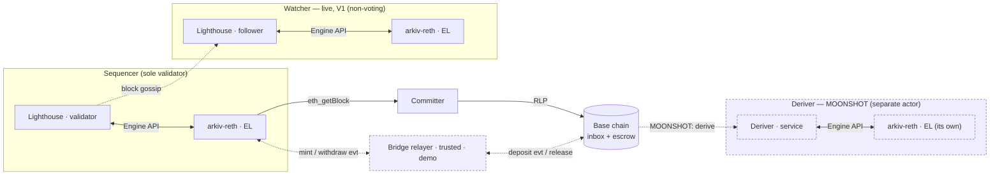
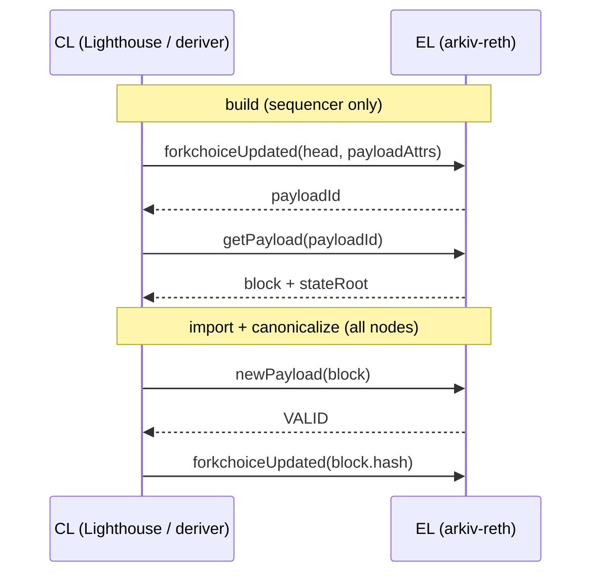
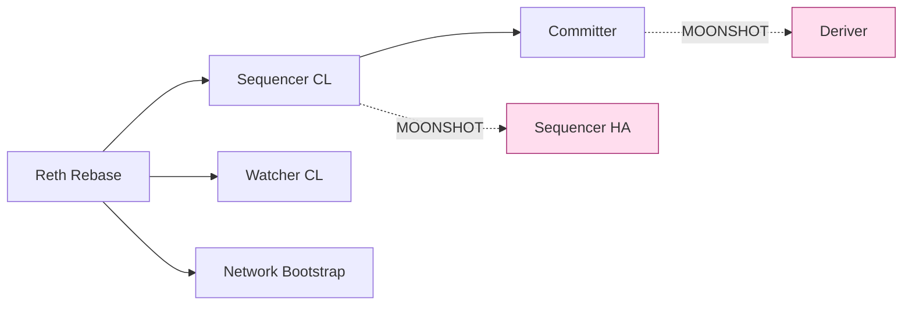
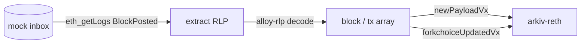
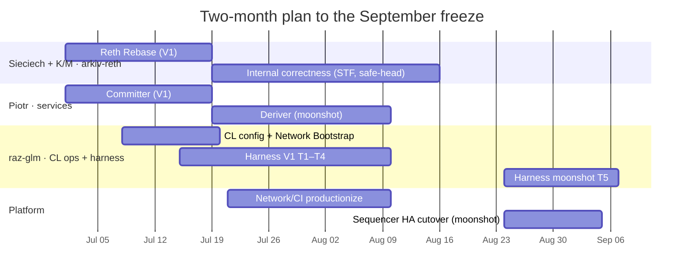
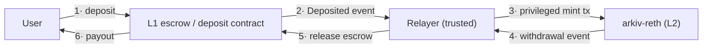
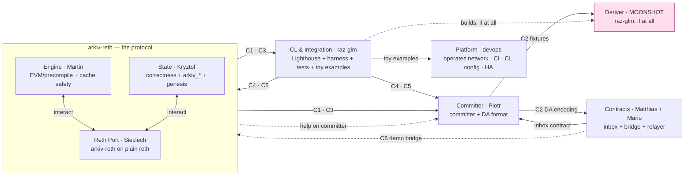

# Arkiv Database-Chain — 2-Month Implementation Plan

**Goal:** a Rust "database chain" — a bespoke **single-sequencer Ethereum network** — code-frozen September, announced end of October.

**Stack:** `arkiv-reth` (execution client) on **plain reth** · **Lighthouse** as consensus · non-voting **watchers** that replicate state · a **committer** that posts blocks to a mock base chain · *(moonshot)* a **deriver** that rebuilds the chain from that base chain.

## 1. Framing — arkiv-reth IS the protocol

`arkiv-reth` is a sealed "modified Ethereum client," owned by **Kryztof + Martin (K/M)**. Treat it as **assumed-correct** and exposing a stable contract. Its internal correctness — deterministic state transition, safe-head recovery, canonical serialization — is *its own* acceptance gate, **not a blocker** for the surrounding systems. Everything else is designed and built **in parallel against the contract**, assuming arkiv-reth behaves like a correct Ethereum EL.

**The contract arkiv-reth exposes** (what everyone else builds against):

- **Vanilla L1 Engine API** (`engine_newPayloadVx` / `forkchoiceUpdatedVx` / `getPayloadVx`) — so a CL (Lighthouse) and the deriver can drive it.
- **Standard EL JSON-RPC** (`eth_*`) + devp2p P2P — blocks, receipts, sync.
- **`arkiv_*` JSON-RPC** — entity queries (`arkiv_query`, counts, block timing).
- **Deterministic STF** — same block inputs ⇒ same state root.

> **Decision (resolved):** arkiv-reth ships as a **vanilla L1** node on **plain reth, not op-reth**. No OP Stack — no op-node, no OP payload types, no deposits/L1-info. This is what makes **Lighthouse** the correct CL. The one-time migration off op-reth is the **Reth Rebase** workstream and is a V1 prerequisite.

## 2. Scope — V1 vs Moonshot

Hard line between what must ship and what is a stretch. **Moonshot items are NOT part of V1** and their absence does not block the announcement.

| Tier | Deliverables | Owner | Product claim |
|---|---|---|---|
| **V1 (must ship)** | Reth Rebase · Sequencer CL · Watcher CL · Network Bootstrap · Committer · **inbox contract** · harness tests **T1–T4** | K/M, raz-glm, Piotr, **Matthias/Mario** | single-sequencer reth chain + live-replicating watchers + **DA committed** to the base chain |
| **Moonshot (stretch, post-freeze OK)** | Deriver (separate actor) · Sequencer HA (external signer) · harness test **T5** | raz-glm (Deriver), Platform (HA) | **reconstruct + follow the chain from base-chain DA alone** (the round trip); HA sequencer |

V1 proves the chain runs, replicates, and *persists recoverable data* to the base chain. The moonshot proves that data is *sufficient to reconstruct from* with an independent client. V1 de-risks the moonshot (see the Committer's DA-decodability gate) without depending on it.

## 3. Architecture

> **Solid = V1 core** (sequencer, live watcher, committer, base chain). **Dotted blue = not V1** (the deriver + its own node, and the demo bridge).
>
> **Watcher and deriver are separate, unrelated actors.** A **watcher** is a live P2P follower (Lighthouse, follows the tip). A **deriver** is its own service that drives **its own arkiv-reth** off the base chain, following **derivation only** — no tip, no Lighthouse, no handoff. They share nothing.
>
> The **bridge relayer** (§11) is the **minimal Option-A** form — a trusted off-chain relayer, **no arkiv-reth protocol change**: base-chain deposits → a privileged L2 mint tx; L2 withdrawal events → escrow release on the base chain.

- **Sequencer** = arkiv-reth + Lighthouse, sole validator. Lighthouse does peer discovery, gossip, and block validation; arkiv-reth executes.
- **Watcher** = arkiv-reth + Lighthouse follower (no validator). Replicates the sequencer's chain via **standard EL P2P + CL gossip** — replication is a property of being an Ethereum full node, **zero bespoke replication code**.
- **Committer** = standalone Rust service. Reads the sequencer's canonical blocks directly over `eth_*` and posts them as RLP calldata to the mock inbox. *(Read the sequencer, not watchers — watchers are downstream followers; sourcing the commitment from them adds a circular trust hop.)*
- **Mock base layer** = anvil / reth dev node + a simple inbox contract. Real bridge + dispute games are out of scope.
- **Deriver (moonshot)** = a **separate actor, unrelated to watchers**. A standalone Rust service driving **its own dedicated arkiv-reth** off the base chain: it reads the inbox and reconstructs + **permanently follows the committed chain via derivation only** — no P2P, no Lighthouse, no tip-following, no handoff. It lags the live tip by the commit cadence and proves the base-chain DA is sufficient to reconstruct the chain independently.

## 4. Why arkiv-reth doesn't modify the Engine API (CL↔EL primer)

This is why the Engine API can be treated as a sealed, upstream-standard contract the whole team builds against.

**The split.** Post-Merge, every Ethereum node is two processes: a **CL** that decides *which* blocks are canonical and in what order, and an **EL** that *runs* each block through the EVM and computes the state root. They meet only over the **Engine API** — a JWT-authed local JSON-RPC. The CL never executes; the EL never decides canonicality.

> A follower/deriver skips `getPayload` (it already has the block) — it only calls `newPayload` then `forkchoiceUpdated`.

**Key fact:** the Engine API moves **blocks** and **fork-choice state** — nothing else. No application-data channel, no "extra index" field. A chain adds features either (a) inside ordinary block execution + the state root, or (b) by changing the block/payload format (and thus the contract). **arkiv-reth chose (a)**, so the wire is unchanged. Concretely, arkiv-reth's only divergence from upstream reth is:

| Divergence | Where | On the wire? |
|---|---|---|
| One EVM precompile at `ARKIV_ADDRESS` (`0x44…0044`) | `arkiv-reth/src/evm.rs`, `precompile.rs` | No — a normal precompile, like `ecrecover` |
| Entity / annotation / system data as **standard trie accounts** → committed to the normal `state_root` | `arkiv-entitydb` | No — no side DB, no second commitment |
| Query-only `arkiv_*` RPC | `arkiv-reth/src/rpc.rs` | No — additive to `eth_*`, zero `engine_*` |

The precompile is just EVM execution → Arkiv state is in the normal `state_root` → block hash, state root, txs, receipts are all stock fields → **Lighthouse receives exactly the payload shape it expects.** The rule it satisfies: *don't displace the EL as the CL's Engine-API counterparty.* A precompile-over-normal-state stays strictly below that line.

**Why the Reth Rebase is cheap:** this property is **EL-flavor-agnostic** — it holds because Arkiv lives in the precompile + normal state. Moving off op-reth swaps only the node-assembly layer; the precompile, entitydb, and `arkiv_*` RPC port across unchanged.

## 5. Prior art — a simplified op-node + op-batcher

The committer/deriver pair is a **stripped-down version of a pattern OP Stack runs in production.** Naming the analogs de-risks the build and points the team at mature code to read.

**op-node** (OP Stack's rollup node = its CL) runs *no* PoS; it **derives** the L2 chain from L1 and **drives** the EL over the Engine API — two halves: a *derivation pipeline* (L1 data → payload attributes) and an *engine driver* (attributes → `newPayload`/`forkchoiceUpdated`).

**Our deriver = the engine-driver half, minus the derivation format.** We read **pre-formed RLP blocks from one inbox contract** instead of decoding frames→channels→batches; no deposits, L1-info, system-config, reorgs, or fault proofs. The hard, subtle part of op-node — the format pipeline — is the part we **don't** build. Likewise **our committer ≈ op-batcher**, minus channels, compression, span batches, and blob DA.

**kona — the closest reference.** A bespoke, small, pure-Rust OP Stack CL (`kona-derive` + `kona-executor`, later `kona-node`) that began as the Rust fault-proof client program. Its derive-and-drive loop is **structurally what our deriver is**, with OP-specific additions layered on. Read `kona-derive`'s engine-driver stage as the template for the Deriver; ignore everything format-specific. *(Confirm current crate names against the kona repo.)*

| Ours | OP analog | OP-specific machinery we omit |
|---|---|---|
| Committer | op-batcher | channels, frames, compression, span batches, blob DA |
| Deriver | op-node engine driver / **kona** (`kona-derive`+`kona-executor`) | frame/channel/batch decode, deposits, L1-info, system-config, reorgs, fault-proof program |

> **Sizing takeaway:** the Engine-API *drive* loop is identical to these mature systems; only the *data-source decode* differs, and ours — one RLP block per inbox log — is the trivial case. The risk in op-node/kona lives in the pipeline we are deliberately not building.

## 6. Build specs

### V1 necessities

**Reth Rebase — rebuild arkiv-reth on plain reth · Owner: Sieciech (reth port) — Martin + Kryztof interact · ~1.5–2.5 wk · blocks Sequencer CL / Watcher CL / Network Bootstrap**
- Re-base node assembly from op-reth onto vanilla reth: `OpEvmFactory<OpTx>` → reth `EthEvmFactory` (keep the Arkiv precompile install); `OpEngineTypes` / `OpEngineApiBuilder` → `EthEngineTypes` / `EthereumEngineApiBuilder`; `OpPayloadAttrs` + the copied OP payload-attrs builder → reth's standard payload attributes; **drop** the hardcoded L1-info deposit; OP genesis → standard L1 `ChainSpec`. Remove all `op-*` deps.
- **Ports as-is (unchanged):** the precompile, `arkiv-entitydb`, the `arkiv_*` RPC.
- **Mempool ordering stays stock:** keep reth's default **priority-fee** ordering (highest effective tip first) — **not FIFO** (Risk #7).
- **Acceptance:** builds with **zero** optimism deps; runs as a reth EL driven by Lighthouse over the vanilla L1 Engine API; entity CRUD + `arkiv_query` behavior unchanged; boots from a standard L1 genesis; **mempool orders by priority fee**.

**Sequencer CL — Lighthouse as a black box · Owner: raz-glm (analysis + toy config) → Platform (operate); Kryztof (genesis) · ~0 dev (config only)**
- Stock `lighthouse bn` + `lighthouse vc`, sole validator. Customize **only** via `config.yaml` (network params) + `genesis.ssz`. Set `SECONDS_PER_SLOT` to target block time. One `vc` (small fixed key set) → one local `bn`.
- *(64 keys is the commonly-cited finality floor — verify against `MIN_GENESIS_ACTIVE_VALIDATOR_COUNT` / committee-fill for your config; devnets often run fewer.)*
- **Don't** fork or patch Lighthouse. Zero code changes.
- **Acceptance:** sequencer proposes **and finalizes** blocks continuously; no diff vs upstream Lighthouse.

**Watcher CL — live replication · Owner: raz-glm (analysis + toy config) → Platform (operate) · ~0 dev (config only)**
- `lighthouse bn` follower, **no `vc`**, `--boot-nodes <sequencer ENR>` (ENR via the sequencer's `--enr-address`). Blocks arrive over devp2p gossip → local arkiv-reth via Engine API. No bespoke replication code. Watchers are **Lighthouse-only** and follow the live tip — a **separate path from the deriver** (its own actor off the base chain — the Deriver); the two never share a node.
- **Acceptance:** a cold-started follower reaches the sequencer's state root + `arkiv_query` results per block (test T2).

**Network Bootstrap — via Kurtosis · Owner: raz-glm (toy example) → Platform (real network) · ~3–5 d**
- Use `ethpandaops/ethereum-package` (EF Kurtosis devnet builder) to generate `genesis.ssz` + `config.yaml` and bring up the net; substitute the **arkiv-reth Docker image** for `reth` as EL, `lighthouse` as CL.
- Kurtosis is the **artifact generator + fast dev bring-up**; the pinned CI harness (§7) is docker-compose **consuming the same generated genesis/config** — one genesis artifact, two runners (avoids chainspec drift).
- **Acceptance:** one command → sequencer + N watchers on a fixed shared genesis.

**Committer · Owner: Piotr (+ Martin, Kryztof) · ~2–3 wk**
- Standalone Rust binary. Pull canonical blocks from the **sequencer** via `eth_getBlockByNumber`, batch as RLP calldata, post to the mock inbox emitting `BlockPosted`. No P2P; no routing through watchers.
- **Freeze the DA encoding now** — the format the committer writes is the contract the (later) deriver reads. Pin and document it in V1.
- **V1 acceptance (no deriver needed):** every sequencer block lands as a `BlockPosted` log that an **offline decoder** can RLP-parse back into a complete, valid block — proving the DA is *sufficient to rebuild from* without building the rebuilder (test T4). This de-risks the Deriver moonshot.

### Moonshot (stretch — NOT V1)

**Deriver (separate actor) · Owner: raz-glm, if at all · ~3–4 wk · stretch** A standalone actor with **nothing to do with watchers**: it is **its own arkiv-reth's sole, permanent** Engine-API driver — no Lighthouse, no handoff. A simplified op-node/kona engine-driver (§5), **no P2P**. It reconstructs and then continuously follows the committed chain from the base chain.

- **Deps:** `alloy-provider` (logs), `alloy-rlp` (decode), `alloy-rpc-types-engine` (Engine types — don't hand-roll). `sled` / flat file for the processed-height cursor.
- **Tasks/effort:** monitor inbox (3–4 d) · extract + RLP-decode (3–5 d) · JWT JSON-RPC Engine client + two-call-per-block loop, `new_payload`→assert `VALID`→ `forkchoice_updated` (~1 wk) · restart-safe cursor (2 d).
- **`Vx`:** match the active hardfork (`V3` = Cancun) on the vanilla L1 Engine API.
- **Watch-outs (start early):** (a) **JWT** — HMAC-SHA256 over `jwt.hex` or you get `401`s; (b) **genesis parent-hash match** — the first processed block's parent hash must equal arkiv-reth's genesis hash or `newPayload` returns permanent `INVALID`.
- **Acceptance:** a fresh, empty arkiv-reth driven only by the deriver from base-chain data alone reaches identical state root + `arkiv_query` vs the sequencer (test T5).

**Sequencer HA — external signer (blue-green) · Owner: Platform (full ownership) · stretch** A PoS sequencer holds validator keys; two instances signing the same keys ⇒ double-sign → slashing/equivocation. HA needs the keys **externalized** and **exactly one active signer** at a time. Key insight: only validator *signing* must be singular — the **beacon node + arkiv-reth replicate freely**. Blue-green = redundant BN+EL on both stacks, one active validator behind a remote signer.

| Piece | Role | Tool |
|---|---|---|
| Remote signer (BLS) | holds the validator key off-box + slashing protection | **Web3Signer** (+ shared slashing DB) |
| Lighthouse VC | proposes/attests via remote keys, not local keystores | `--web3-signer` validator definitions |
| Overlap guard | a new VC confirms the key isn't already live before signing | Lighthouse **doppelganger protection** |
| Active/passive coordinator | enforces one active signer across blue/green | **platform-owned** (prior art: OP `op-conductor` + `op-signer`) |
| EL/service signer (secp256k1) | the committer's base-chain key | `clef` or Web3Signer-secp256k1 |

- **Fully owned by Platform — *not* a Protocol-team deliverable.** Platform runs its own example reth + Lighthouse stack, experiments with the remote signer + the blue-green cutover (deactivate → activate, no overlap), and writes runbooks as it sees fit. Protocol provides only the standard V1 binaries/configs it already ships — no extra HA artifact from K/M.
- **Acceptance:** a documented blue-green cutover of the sequencer with **zero double-sign** (slashing protection verified); BN + EL redundant, validator singular.
- **Caveat (state plainly):** operational resilience only — it shortens sequencer downtime; it does **not** decentralize. A fully-down single sequencer still halts the chain; HA just makes "fully down" rarer.

## 7. Testing & verification — raz-glm's harness

**Black-box only. We are not using the in-process `World` system — it is not being salvaged.** The harness is a **fresh external Rust client (`arkiv-harness`)** that drives **real running nodes over RPC** — a single container for DB tests, the full docker-compose / Kurtosis network for the rest. It asserts over `eth_*` / `arkiv_*` / the base-chain RPC, never in-process.

Consequence: **determinism and safe-head are proven as black-box properties** — two independently-built node processes syncing the same chain reach identical state roots (T2), and a node resumes its safe head after restart (T3). No in-process re-execution gate.

| # | Test | Tier | Proves | Setup |
|---|------|------|--------|-------|
| **T1** | **DB correctness** — full CRUD lifecycle + every query-operator class (eq, IN, ranges, glob, boolean, pagination, historical) returns correct results | V1 | the database semantics are right | single running node, `arkiv_*` RPC |
| **T2** | **Live replication + determinism** — a watcher syncing from the sequencer reaches identical state root + `arkiv_query` per block (two independent builds ⇒ same root) | V1 | watchers replicate; STF is deterministic | sequencer + 1 watcher (compose) |
| **T3** | **Crash recovery** — kill/restart the sequencer ⇒ safe head + queries resume; an isolated watcher catches up on reconnect | V1 | "tracks a sole sequencer after death" | full network + restart |
| **T4** | **DA sufficiency** — every sequencer block on the mock inbox is RLP-decodable back into a complete block by an offline decoder | V1 | committer persists *recoverable* DA | sequencer + committer + base chain |
| **T5** | **Commit→derive round-trip** — op on sequencer → committed to base chain → the deriver's **own, fresh** node reconstructs **from base-chain data only** → identical query results (and keeps following) | **Moonshot** | committer + deriver end-to-end | deriver + its node + base chain, no P2P |

**V1 gate = T1–T4.** T5 is the moonshot acceptance and does not block the freeze.

Effort: fresh black-box harness ≈ **6–9 eng-weeks** for raz-glm (docker-compose / Kurtosis network + external RPC client are the bulk; no in-process plumbing to build or maintain).

## 8. Team & sequencing (fully parallel — nothing waits on arkiv-reth)

- **Contract-first, week 1:** Sieciech + K/M land **Reth Rebase** + publish a **single shared genesis/chainspec artifact** and a **stable arkiv-reth binary** (even while internal correctness is still hardening). This unblocks Piotr and raz-glm.
- Piotr builds the committer against the contract using fixtures + a running node; the deriver follows once the DA format (the Committer's) is frozen.
- raz-glm builds CL config + the Kurtosis/compose network + the black-box harness in parallel.

## 9. Top risks to the September freeze

1. **Reth Rebase (off op-reth → reth).** Foundational; Sequencer CL / Watcher CL / Network Bootstrap depend on it. *Owner Sieciech — Martin + Kryztof interact; size
   + start week 1.* (My ~1.5–2.5 wk estimate assumes the precompile/ entitydb layer is genuinely flavor-agnostic, as verified — confirm no hidden OP-specific block/header behavior.)
2. **arkiv-reth determinism / safe-head fix runs long.** Decoupled so it doesn't stall the surrounding build, but T2/T3 can't pass until it lands.
3. **Genesis/chainspec drift** between Kurtosis and the CI compose network. *One shared generated artifact (Network Bootstrap).*
4. **Port churn** in multi-node runs. *Fixed published ports in compose.*
5. **Moonshot scope creep.** the Deriver and Sequencer HA are explicitly out of V1 — do not let the round-trip or HA become freeze blockers. T4 (DA decodability) is the V1 insurance that the data *will* be rebuildable later.
6. **Per-block in-memory cache vs. smart-contract safety — gate before merge.** Martin's per-block account cache ([arkiv-op-reth#104](https://github.com/Arkiv-Network/arkiv-op-reth/pull/104), Draft) holds entity / pair-bitmap / index-tree writes in a **side structure outside revm's journaled state**, committing at the **precompile-call boundary** and flushing the bytes only at block end (`BlockExecutor::finish`).
   - **Main failure vector — transaction revert after entity creation.** A transaction is *not* just one precompile call. A smart contract can `CALL ARKIV_ADDRESS` (create/update an entity → the cache **commits** that write), then do more work and **`REVERT` the whole transaction**. revm rolls back its journaled state, but the cache already committed at the *inner call*, not the *enclosing tx* — so at `finish` it flushes the **phantom entity that consensus reverted**. Cache-off journaled the write and rolled it back, so it has no entity. **Cache-on ≠ cache-off → consensus split.** (Same root cause — the cache isn't part of revm's state — also lets a mid-block `EXTCODEHASH`/`EXTCODECOPY` of a cached account read stale bytes.)
   - **Why CI is green anyway.** With **Arkiv-only txs the precompile call *is* the whole transaction** — the commit boundary and the tx boundary coincide and nothing reverts after, so the PR's "stateRoot byte-identical" check (run only on that closed workload) holds. The cache's stated per-tx atomicity is really *per-precompile-call*; it never addresses a tx that reverts **after** a successful precompile call.
   - **But the chain must host smart contracts** — bridging needs them (the L2 withdrawal / minter predeploy, §11). So the cache is a **pure speed optimization** and must be **re-analyzed + merged only once proven `cache-on ≡ cache-off` under arbitrary contract execution** — the cache must follow revm's journal and roll back on **tx** revert, not just on precompile revert. Until then keep it **off the consensus-critical path / behind a flag**.
   - *Owner: Engine (Martin). Confirming test: a contract that creates an entity via the precompile then **reverts the transaction** — assert the entity does not exist and stateRoot matches cache-off.*
7. **Mempool ordering must stay priority-fee — not FIFO (corrects an earlier assumption).** The sequencer must order its mempool by **priority fee (highest effective tip first)** — reth's and geth's default, on L1 and L2 alike. **FIFO is a known-bad design:** it gives no way to discover the chain's true gas price and is a standing **griefing/spam vector** (cheap txs hold up the queue). The earlier notion that a single-sequencer DB chain "only needs FIFO" is wrong. *OP-stack nuance:* priority-fee orders the **sequencer mempool**; **FIFO applies only to L1 forced-inclusion (deposit) txs** — of which this chain has **none in V1** (the Option-A bridge submits ordinary priority-fee txs, §11; forced inclusion would only arrive with Option B). So keep stock reth ordering; revisit FIFO only if forced-inclusion deposits are ever added. *Owner: Engine (Martin) — preserve the default `TransactionPool`; raz-glm validates with a fee-ordering test (mixed-tip txs must be included highest-fee-first, not arrival order).*

## 10. Critical files & new crates

- `arkiv-reth/src/evm.rs` — EVM/engine assembly; **the Reth Rebase migrates this off op-reth to plain reth** (`OpEvmFactory<OpTx>` → reth `EthEvmFactory`; drop the dev-only hardcoded L1-info deposit).
- `arkiv-reth/src/precompile.rs`, `arkiv-entitydb`, `arkiv-reth/src/rpc.rs` — **ported unchanged** in the Reth Rebase (EL-flavor-agnostic).
- `docker/runtime.Dockerfile` — single-node image fed to Kurtosis / compose.
- `justfile` — new `compose-up` / `net-test` recipes (fixed ports).
- **New crates:** `arkiv-committer` (Piotr) · `arkiv-deriver` (raz-glm, if at all) · `arkiv-harness` (raz-glm, black-box external client).
- **Sequencer HA (moonshot):** **fully owned by Platform** — its own example reth + Lighthouse stack, Web3Signer / slashing-protection experiments, and cutover runbooks. Not a Protocol-team deliverable.

**Out of scope entirely:** OP Stack / op-node, dispute & fault proofs, trustless bridging (deposits/withdrawals — see §11), multi-sequencer fork-choice, alt-DA / blob DA, and the in-process `World` test harness.

## 11. Bridging (deposits/withdrawals) — out of V1

Today the base chain is a **DA target only** — it stores L2 block data; it does not custody funds or trust any L2 state. Deposits/withdrawals add a **bridge**, which is exactly the OP Stack piece we deliberately cut. Two hard facts set the cost:

- **Deposits (L1→L2) need forced inclusion** — deterministic, censorship-proof injection of base-chain events into L2 blocks. That's **op-node's derivation job; Lighthouse has no concept of it.** A vanilla Lighthouse+reth chain is *sovereign* — it derives from no L1. So deposits don't slot into the CL; you'd inject them in arkiv-reth's block builder (a protocol change that **partly un-does the Reth Rebase**) or move sequencing to an op-node-shaped component.
- **Withdrawals (L2→L1) need the base chain to trust an L2 state commitment** — a posted output root + Merkle proof. Who may post it, and can they lie? Without fault proofs: a **trusted proposer, and yes**. Nuance: you already run a single sequencer, so the chain is *already* trusted — the only **new** risk is the operator stealing base-chain escrow via a false root. Irrelevant for a devnet, fatal for real value.

Three options, by trust vs effort:

| Option | Trust model | Protocol change | Effort | Freeze-compatible? |
|---|---|---|---|---|
| **A — Trusted relayer (demo-grade)** | fully trusted relayer | **none** | **~2–3 wk** | **Yes** |
| B — OP-style permissioned bridge | trusted proposer (no fault proofs) | yes — re-adds deposit-tx + forced inclusion | ~8–14 wk | No — post-freeze |
| C — Trustless bridge | fault or validity proofs | major | multi-quarter | No — different project |

### Recommended: Option A — trusted relayer

A privileged off-chain relayer watches both sides. **No arkiv-reth protocol change, no forced inclusion, no output-root proofs** — it preserves the clean vanilla-reth node from the Reth Rebase.

- **Components:** a simple L1 escrow/deposit contract; the **relayer** service (watch L1 deposits → submit L2 credit tx; watch L2 withdrawals → submit L1 release tx); a privileged mint/release authority on each side (a funded L2 account or a tiny mintable predeploy).
- **Smart contracts on the arkiv chain:** the L2 side (withdrawal / mintable predeploy) means the chain must execute **arbitrary smart contracts** — which is exactly what **gates Martin's per-block in-memory cache** until it is proven contract-safe (Risk #6).
- **Why A:** only option compatible with the September freeze; adds **no new trust beyond the single sequencer you already run**; touches none of the Reth Rebase / Sequencer CL / Watcher CL / Committer. Good enough to *demonstrate* deposits and withdrawals end-to-end.
- **Limits (state them plainly):** fully trusted relayer (can mint arbitrarily), no censorship resistance, no trust-minimized custody. Fine for devnet/testnet; **not** for real-value mainnet.

### Option B — OP-style permissioned bridge (post-freeze)

Real forced-inclusion deposits + output-root withdrawal proofs, single trusted proposer, **no** fault proofs. Re-adds OP-shaped machinery and is its own workstream:

| Component | Where | ~Effort |
|---|---|---|
| Deposit portal + escrow | base chain (Solidity) | 1–2 wk |
| Output-root oracle | base chain | 0.5–1 wk |
| Withdrawal prove/finalize (+ delay) | base chain | 1.5–2.5 wk |
| Deposit tx type + forced inclusion at block-build | **arkiv-reth** | 2–4 wk *(riskiest; partly un-does the Reth Rebase)* |
| L2 withdrawal predeploy (message passer) | arkiv-reth / predeploy | 1–2 wk |
| Proposer service (post output roots) | new Rust svc (committer sibling) | 1–1.5 wk |
| Deposit feed into the sequencer | integration | 1–2 wk |
| E2E + determinism-with-deposits + hardening | all | 2–3 wk |

Heavy reuse of OP reference contracts (`OptimismPortal`, `L2OutputOracle`) and op-reth deposit machinery pulls toward the low end; clean-from-scratch toward the high end. Still **trusted** — the proposer's roots are believed. Turns the base chain from a DA target into a **trust anchor**.

### Option C — Trustless bridge

Add fault proofs (cannon/kona prestate + dispute game) or zk validity proofs so the base chain needn't trust the proposer. This is "become a real rollup" — effectively re-adopting OP Stack or a zk stack. Multi-quarter; out of scope for this plan.

## 12. Workstreams, ownership & contracts (delegation)

Aggressively parallelized and **interface-first**: every stream builds against a **written contract** (below), so nobody waits on anybody. Each engineer owns the area matching their expertise; raz-glm owns the testing/integration surface — harness, CI, the network, and the contracts that tie the streams together — and reviews Rust across streams.

### Ownership map

| Workstream | Owner | Area of expertise | Builds |
|---|---|---|---|
| **Reth Port** | **Sieciech** (+ Martin, Kryztof interact) | reth / op-reth internals | the **Reth Rebase** — arkiv-reth onto plain reth |
| **Engine** | **Martin** | database-chain / precompile / reth design | EVM/precompile; **arkiv-reth drivable by Lighthouse to finality**; **per-block cache (#104) gated on smart-contract safety (Risk #6)**; **interacts with Sieciech on the reth port**; assists the Committer |
| **State** | **Kryztof** | arkiv-reth internals, CRUD/perf profiling | determinism/safe-head, `arkiv_*` schema, genesis/chainspec; **the watcher keep-up budget** (throughput profile); assists the Committer |
| **Committer** | **Piotr** (+ Martin, Kryztof) | services / committer | Committer + **frozen DA format** + offline decoder |
| **CL & Integration** | **raz-glm** | Rust, reth, CL/EL integration, testing-harness design | **Lighthouse analysis** + arkiv-reth↔Lighthouse + watcher keep-up **validation**; `arkiv-harness` + tests + CI; **toy/reference examples** of the network, CI, and CL config; curates the contracts |
| **Platform** | **Platform / devops** | infra, CD, GH runners | **operates the real thing** from raz-glm's toy examples — network deployment, CI runners, CL-config operation; **fully owns Sequencer HA / blue-green cutover** (own reth-lighthouse stack, experiments, runbooks) |
| **Deriver** | **raz-glm** (if at all) | — | Deriver (moonshot, last) |
| **Contracts** | **Matthias + Mario** | Solidity / EVM contracts | **V1:** mock inbox contract + base-chain dev node · **demo (§11):** L1 escrow/deposit + L2 withdrawal + **relayer** + privileged minter |

Piotr leads the Committer, with Martin and Kryztof lending a hand as it comes together. raz-glm's own sequence is **harness first**, then **stub-based system testing** against the published contracts, and only **then — if there's room — the Deriver**. The Deriver is the lowest-priority moonshot and may not be built at all, without blocking V1. **Contracts owns all on-chain Solidity + the relayer:** the inbox (the DA target the committer posts to) is **V1**; the deposit/withdrawal bridge is the **demo** Option-A system from §11 and is out of V1.

**De-risking the integration role (raz-glm sits on the CL↔EL seam).** Three rules keep raz-glm to *decide + validate*, not *fix + operate*:

1. **Owners gate their own integration-readiness.** Martin's bar is *Lighthouse drives arkiv-reth to finality* (not just compiles+boots); Kryztof reports the *keep-up budget* (execute+import vs. slot time). Node bugs surface in their streams, not when raz-glm wires it together.
2. **raz-glm ships toy/reference examples; Platform operates production.** The network bring-up, CI pipeline, and CL config exist first as a **minimal raz-glm example**, then Platform productionizes and runs them (same pattern as Sequencer HA). raz-glm owns the decisions; Platform owns the toil.
3. **raz-glm writes the harness + tests and *surfaces* failures; fixing is the owning workstream's risk.** A red test routes to the component owner — Martin → node, Piotr → committer, Kryztof → DB/perf, Matthias/Mario → contracts — never to raz-glm.

### The contracts (the parallelization seams)

Each is **frozen and published early** (the M1 milestones) so consumers stub against it. *"Assume"* = build against this spec / a stub before the real thing lands.

**C1 — arkiv-reth node contract** · provider Engine + State · consumed by all
- Vanilla L1 **Engine API** (`engine_{newPayload,forkchoiceUpdated,getPayload}V3`, JWT on `:8551`); **`eth_*`** (`:8545`) incl. `eth_getBlockByNumber` / `eth_getLogs`; **`arkiv_*`** (`arkiv_query`, `arkiv_getEntityCount`, …) with a **frozen request/response schema**.
- Deterministic STF; safe head persisted across restart.
- Delivered as a versioned **docker image** `arkiv-reth:<tag>` + the genesis artifact.
- *Stub until it lands:* one dev container, or the documented schema others code to.

**C2 — DA format + inbox contract** · **DA encoding** by the Committer (Piotr), **inbox contract** by Contracts (Matthias + Mario) · consumed by Deriver + Harness
- Inbox ABI: `postBlock(bytes)`; event `BlockPosted(uint256 indexed number, bytes32 hash, bytes rlp)`.
- **DA encoding v1 (frozen):** one L2 block per event, RLP of the full block; exact field list documented + versioned.
- **Fixtures:** sample `BlockPosted` logs (JSON) for the offline decoder + deriver.
- *Stub until it lands:* deriver + harness build against the spec + fixtures, not the live committer.

**C3 — Genesis / chainspec artifact** · provider State · consumed by all
- One shared L1 chainspec (`genesis.json`) + derived `genesis.ssz`, **pinned hash**. Everyone bootstraps from the same artifact (kills chainspec drift, Risk #3).

**C4 — Network endpoints / topology** · provider Harness · consumed by harness + services
- Fixed `host:port` map: sequencer (eth/engine/arkiv), watcher, base-chain RPC, inbox address, shared `jwt.hex`.

**C5 — CL config** · provider Harness · consumed by ops
- `config.yaml` (`SECONDS_PER_SLOT`, fork schedule), validator keys, JWT secret.

**C6 — Bridge interface (demo, out of V1)** · provider Contracts · consumed by users/demo
- L1 escrow ABI: `deposit()` (payable) emitting `Deposited(address indexed user, uint256 amount)`; `release(address to, uint256 amount)` — relayer-only.
- L2 withdrawal: a predeploy/contract emitting `Withdrawal(address indexed user, uint256 amount)`; a privileged **minter** path for crediting deposits.
- **Relayer** config: watched events + the privileged keys on each side.
- *Trusted* (relayer can mint) — see §11 for the trust model and limits.

### Milestones (leadership-legible — each = a demoable outcome)

| Workstream | M1 (≈wk 1–2 · unblocks others) | M2 (≈wk 3–5) | M3 / V1 (≈wk 6–8) |
|---|---|---|---|
| **Reth Port · Sieciech** (Martin, Kryztof interact) | reth-based arkiv-reth **compiles + boots**, zero `op-*` deps | **stable image + binary**; **Lighthouse drives it to finality** | precompile + entitydb **parity** vs pre-migration |
| **State · Kryztof** | **C1 schema + C3 genesis published** | **determinism** (two builds → same root) + **safe-head** recovery green | CRUD/perf profile + **keep-up budget** + `arkiv_query` operator coverage |
| **Committer · Piotr** | **C2 DA encoding + fixtures published** | committer posts live blocks; **offline decoder round-trips (T4)** | committer hardened (restart-safe cursor, backfill) |
| **CL & Integration · raz-glm** | **Lighthouse analysis** + harness scaffolding on stubs/fixtures + contracts doc + **toy** network/CI/CL-config example | **T1 + T2** green vs real nodes in CI | **T3 + T4** green → **V1 gate** |
| **Platform · devops** | *(waits on raz-glm's toy example)* | network + CI runners **productionized** from the toy example; CL config operated | **Sequencer HA / blue-green cutover** — owned end-to-end *(moonshot)* |
| **Contracts · Matthias + Mario** | **inbox contract + base-chain dev node up** (unblocks committer + harness T4) | demo bridge deployed; **relayer relays a deposit + a withdrawal** end-to-end | demo bridge documented + hardened |
| **Deriver · raz-glm** (if at all) | reconstructs a few blocks from **C2 fixtures** | **T5 round-trip** green vs live network | *(post-freeze)* steady-state derivation parity |

**The M1 row is the unblock gate** (≈week 2): once C1, C2, C3 are published, the core streams run independently (Platform follows raz-glm's reference examples). M2 = "it works in CI." M3 = V1 ship. Report those three checkpoints per stream to leadership.
